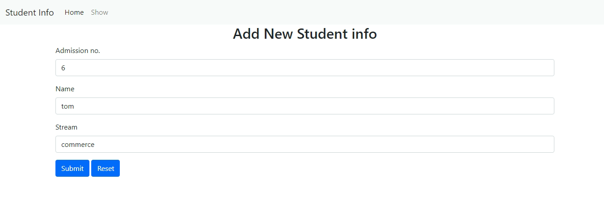
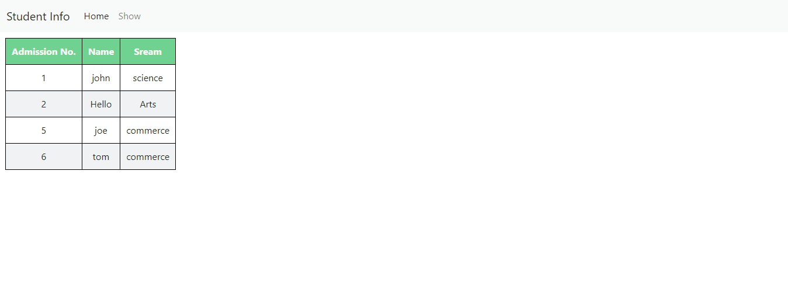

# Student Info Form

## Table of contents

- [Overview](#overview)
  - [Screenshot](#screenshot)
  - [Links](#links)
  - [Built with](#built-with)
  - [What I learned](#what-i-learned)
  - [Continued development](#continued-development)
  - [Useful resources](#useful-resources)
- [Author](#author)

## Overview

### Screenshot

### Built with

- Semantic HTML5 markup
- CSS custom properties
- Bootstrap
- PHP
- MySQL

### What I learned
- styling table
- making use of SELECT statement

### Continued development
- This project needs a improvement of showing the data using filter property.

### Useful resources
- [Bootstrap](https://getbootstrap.com/) - This helped me to create responsive navbar and form easily.
- [w3schools](https://www.w3schools.com) - This helped me to connect my frontend part with the backend (php MySQL)
- [Flatuicolors](https://flatuicolors.com/
) - This helped me to copy colours with the click of button.

## Author
- GitHub - [@thevarungrovers](https://www.github.com/thevarungrovers)
- Codepen - [@thevarungrovers](https://www.codepen.io/thevarungrovers)
- Twitter - [@thevarungrovers](https://www.twitter.com/thevarungrovers)

